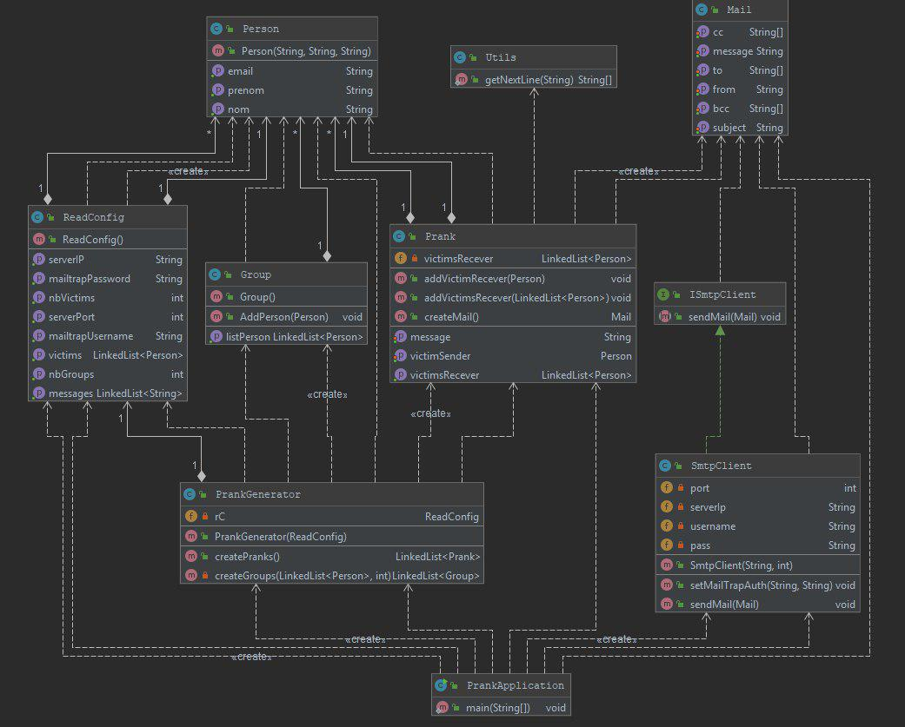

# RES - Labo SMTP

Alexandre Marques et Alison Savary

## Description
Ce repository contient une application java ayant pour but de faire des blagues par mail. 

A partir d'un fichier contenant des adresses mail fourni
par l'utilisateur, l'application forme différents groupes. Pour chaque groupe, une adresse mail est sélectionnée en tant
qu'émetteur du mail, les autres adresses seront les récepteurs. 

L'application se charge ensuite, à l'aide du protocole SMTP, d'envoyer un mail à chaque récepteur.

Cette application a été réalisée selon les instructions fournies par le cours de RES 2019 de la HEIG-VD. Le repository 
d'instruction se trouve [ici](https://github.com/SoftEng-HEIGVD/Teaching-HEIGVD-RES-2019-Labo-SMTP).
## Installer et utiliser un serveur SMTP avec Docker
Pour utiliser l'application en toute sécurité (sans vraiment envoyer les emails) et éviter de se faire blacklister par un 
serveur, nous vous proposons d'utiliser un serveur mock. C'est un serveur simulant un service donné, permettant de faire 
des tests dans des conditions réelles, mais sans envoyer les mails. 

Nous avons choisi d'utiliser le serveur [MockMock](https://github.com/tweakers/MockMock) pour ce labo. 
Nous avons téléchargé le fichier .jar proposé. 

Pour pouvoir utiliser MockMock avec Docker, il nous faut une image,
nous avons donc créé un dockerfile en se basant sur l'exemple donné pour la démo "SimpleJavaServer". Il suffit finalement
de construire l'image et ensuite de lancer un container de cette image. 

Dockerfile :
```
FROM java:8

#
# When we build the image, we copy the executable jar in the image file system. 
#
COPY MockMock.jar /opt/app/server.jar


EXPOSE 25
EXPOSE 8282

#
# This is the command that is executed when the Docker container starts
#
CMD ["java", "-jar", "/opt/app/server.jar"]
```

Attention, pour la création de l'image, `MockMock.jar` doit se trouver dans le même dossier que le `dockerfile`

Création de l'image :
`docker build --tag mockmock .`

Lancer le container : 
`docker run -p <port souhaité>:25 -p <port souhaité>:8282 -d mockmock`

## Configuration de l'application
Notre application se configure à l'aide de 3 fichiers de configuration différents. 
- Un fichier `config.properties` contenant l'adresse du serveur SMTP, le port à utiliser, le nombre de groupe et 
éventuellement les identifiants permettant la connexion avec [Mail Trap](https://mailtrap.io/), un autre service permettant
de simuler l'envoi d'email. ATTENTION, dans le fichier, les identifiants doivent être donnés encodé en base 64 !
- Un fichier `message` contenant les emails à envoyer, les messages doivent tous commencer par **Subject:** et se terminer par **#END**
- Un fichier `victim` contenant les adresses emails des victimes

### Exemples des fichiers de configurations
Vous trouverez des exemples pour les fichiers de configuration dans le dossier config.

## Utilisation de l'application
Afin d'utiliser l'application, il suffit de clone ou fork ce repo. Une fois ceci fait, faites la commande `mvn clean install` 
dans le répertoire où se trouve le fichier pom.xml (normalement à la racine de votre repo). 
Vous trouverez ensuite l'application `labosmtp-1.0-SNAPSHOT-launcher.jar` dans le dossier `target`. Pour exécuter l'application,
il vous suffit de mettre dans le même dossier l'application `.jar` et le dossier `config` contenant les 3 fichiers de configuration 
mentionnés précédemment, que vous aurez complété avec les configurations souhaitées.

## Implémentation
Pour notre implémentation, nous avons principalement suivi les vidéos de M. Liechti se trouvant [ici](https://youtu.be/ot-bDyqgTtk).

Nous avons séparé notre application 4 packages principaux
- config, contenant la classe permettant de lire les 3 fichiers de configuration
- model, contenant 2 packages
     - mail, contenant les classes permettant de représenter une personne, un email et un groupe. Ces classes pourraient être réutilisées dans 
     une autre application envoyant des mails. 
     - prank, un package spécifique à cette application, permettant de générer les blagues.
- smtp, contenant l'interface et le client SMTP implémentant cette interface 
- util, reprenant une fonction d'un [labo précédent](https://github.com/Boosterloop/Teaching-HEIGVD-RES-2019-Labo-Java-IO)
permettant de lire ligne par ligne un `String`.

Nous avons choisi d'implémenter un client SMTP et un modèle de mail gérant les copies et les copies cachées, mais n'avons 
pas utilisé ces fonctionnalités pour ce labo. Il en est de même pour la classe `Person` permettant d'avoir un nom et un prénom, 
qui ne sont pas utilisés dans le cadre de cette application.

### Diagramme de classes de note application
